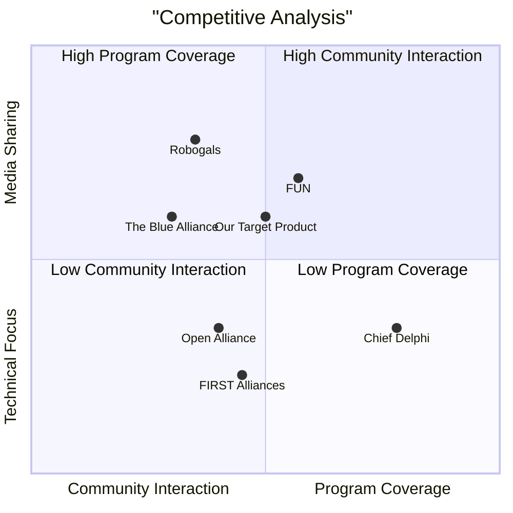

# Product Requirement Document (PRD)

## Language & Project Info
- **Language:** English
- **Programming Language:** React, JavaScript, Tailwind CSS
- **Project Name:** tba_community
- **Original Requirements:** Create a community-driven platform inspired by TBA, YouTube, and Instagram for robotics programs like FIRST, VEX, RoboCup, and more.

## Product Definition

### Product Goals
1. Build a centralized hub for robotics teams to share updates, videos, and connect across programs.
2. Enable mentorship and collaboration between teams of different levels and programs.
3. Gamify engagement with leaderboards and community recognition.

### User Stories
1. As a robotics team, I want a dedicated page to showcase my robot reveals and progress so that I can share my journey with the community.
2. As a mentor, I want to connect with younger teams to provide guidance and support.
3. As a viewer, I want to follow teams and receive notifications about their updates.
4. As a program organizer, I want to endorse top-performing teams and posts for awards.
5. As a student, I want to explore other robotics programs and connect with experienced mentors.

### Competitive Analysis
| Platform | Pros | Cons |
|----------|------|------|
| The Blue Alliance (TBA) | Organized match stats and videos | FRC-only, limited community interaction |
| FIRST Alliances | Useful for event coordination | Limited to FTC, lacks media sharing |
| FUN (FIRST Updates Now) | Robot reveals and behind-the-scenes content | No direct community platform |
| Chief Delphi | Great for technical Q&A | Text-based, lacks visual engagement |
| Open Alliance | Transparency initiative | Competitive focus, lacks mentorship reach |
| Robogals, RoboCup Board, STEMBoard, VEX Forum | Valuable forums | Fragmented, program-specific |

## Technical Specifications

### Requirements Analysis
The platform must:
- Support multi-program integration (FLL, FTC, FRC, VEX, RoboCup).
- Provide team pages with customizable profiles.
- Enable media uploads (images, videos) with tagging.
- Include a dynamic feed for updates and highlights.
- Facilitate mentorship connections and networking.
- Offer gamified engagement features like leaderboards.

### Requirements Pool
- **P0:** Multi-program support, team pages, media uploads, dynamic feed.
- **P1:** Mentorship features, notifications, commenting system.
- **P2:** Stats tracking, live workshop support, mobile app integration.

### UI Design Draft
Basic layout:
- **Homepage:** General feed with filters.
- **Team Pages:** Profile with bio, logo, links, and updates.
- **Post Page:** Media viewer with comments and reactions.
- **Mentorship Section:** Connect button and badges.

### Open Questions
1. What specific APIs should be integrated for real-time updates?
2. How will the leaderboard system be endorsed by robotics programs?
3. What criteria will be used for gamified engagement metrics?

